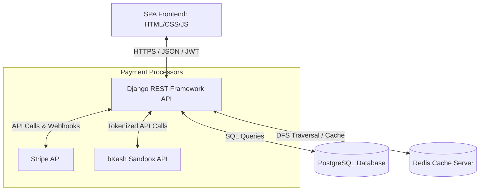
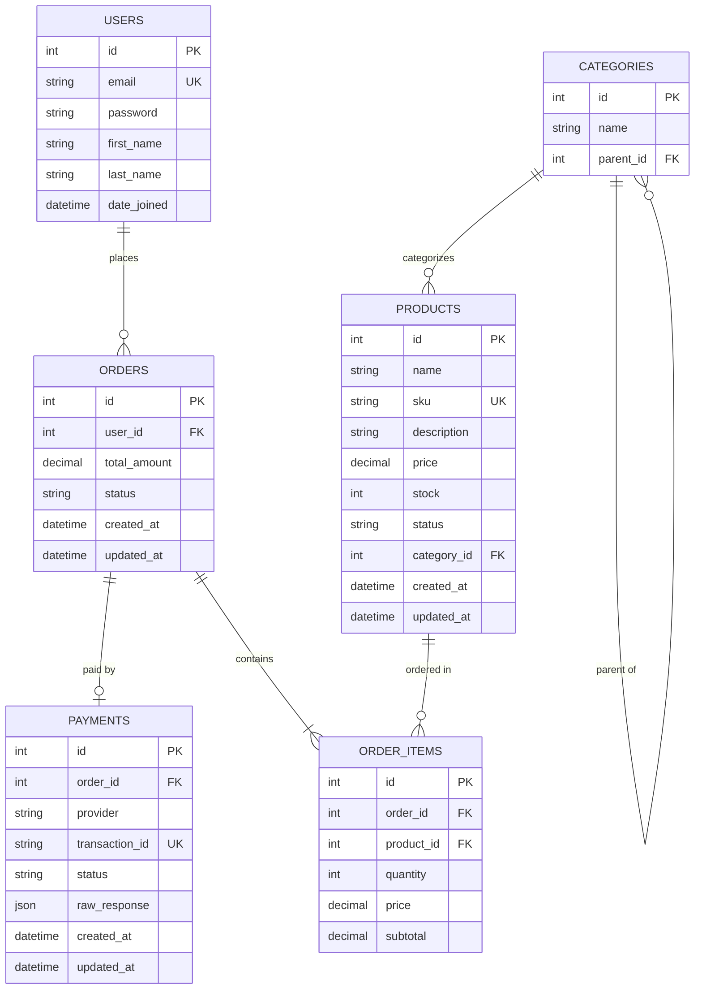
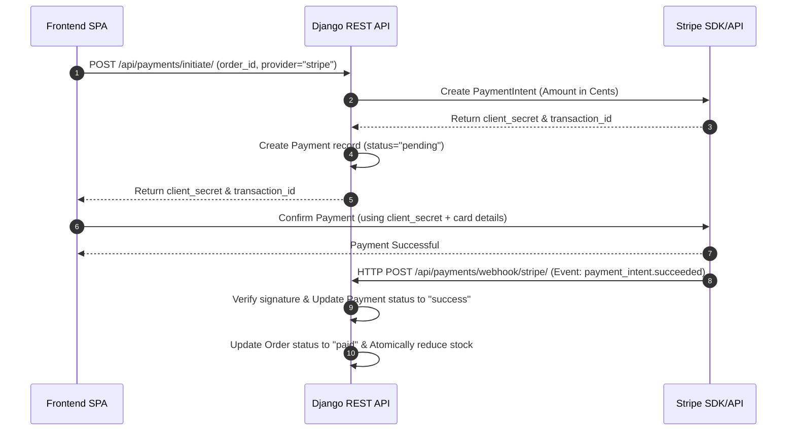
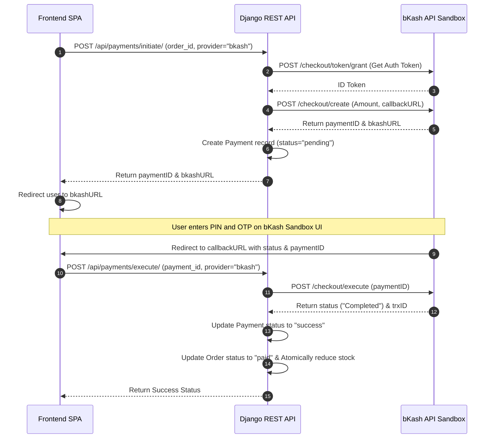

# E-commerce Ordering & Payment System

A full-stack, enterprise-grade E-commerce Ordering and Payment System. This project features a robust Django REST Framework (DRF) backend implementing advanced OOP design patterns, and a highly responsive, modern Single Page Application (SPA) frontend.

It supports authentication, category-hierarchy product management, order processing, and payment integrations using **Stripe** and **bKash** (tokenized sandbox checkout) via the **Strategy Design Pattern**.

---

## 🏗️ System Architecture

The following diagram illustrates the system components and interactions:



---

## 📊 Database Schema (Entity Relationship Diagram)

Below is the database structure depicting how tables are related, including custom indexes on keys for optimal query performance:



---

## 🛠️ Design Patterns & Algorithms

### 1. Strategy Pattern for Payment Integration
To support multiple payment providers without inflating the ordering or core checkout codebase, a **Strategy Design Pattern** is used:
- **`BasePaymentStrategy`**: Abstract class defining `initiate_payment`, `execute_payment`, and `query_payment`.
- **`StripePaymentStrategy`**: Concrete implementation interacting with Stripe's PaymentIntent APIs and handling webhooks.
- **`BkashPaymentStrategy`**: Concrete implementation handling tokenized grant token, create payment, execute payment, and query APIs in sandbox.
- **`PaymentContext`**: Context class that resolves and delegates operations dynamically to the active strategy.

### 2. DFS & Caching for Category Hierarchy Recommendations
- **Depth First Search (DFS)** is used to traverse the category hierarchy. When recommending related products, the tree of category IDs is traversed recursively (using DFS) to fetch products from the selected category and all its children/descendants.
- **Redis Caching**: The category tree hierarchy is computed as an adjacency list and cached in Redis. The DFS traversal is performed over this cached tree, minimizing database reads during traversal. Any category addition or deletion invalidates the cache automatically.

### 3. Order Calculations & Safe Stock Reduction
- All order totals and item subtotals are calculated using deterministic arithmetic to avoid float representation errors.
- Database transactions (`select_for_update`) ensure that product stock is safely and atomically reduced upon successful payment, preventing race conditions.

---

## 💳 Payment Flows

### Stripe Payment Flow


### bKash Payment Flow (Tokenized Sandbox Checkout)


---

## ⚡ Tech Stack

- **Backend Framework**: Django 5.x + Django REST Framework (DRF)
- **Database**: PostgreSQL (Relational DB)
- **Caching & Cache Store**: Redis
- **Security**: JWT (SimpleJWT) authentication
- **Documentation**: Swagger UI & Redoc (via `drf-spectacular`)
- **Frontend**: Single Page Application (HTML5, Vanilla CSS3, Vanilla ES6 JavaScript)
- **Containerization**: Docker & Docker Compose

---

## ⚙️ Project Setup

### Prerequisites
- Docker & Docker Compose (Recommended)
- *Or* Python 3.10+, PostgreSQL, and Redis installed locally.

### Environment Configurations
Create a `.env` file in the `Ecommerce/` directory. (A sample `.env` is already configured in the folder for sandbox testing):
```env
# Django settings
SECRET_KEY=django-insecure-ricco-ecom-ordering-payment-system-2026
DEBUG=True
ALLOWED_HOSTS=localhost,127.0.0.1,*

# Database Configuration
DATABASE_URL=postgres://postgres:12345678@db:5432/ecom_ricco_db

# Cache / Redis Configuration
REDIS_URL=redis://redis:6379/0

# Stripe API Keys (Test Mode)
STRIPE_PUBLISHABLE_KEY=pk_test_...
STRIPE_SECRET_KEY=sk_test_...
STRIPE_WEBHOOK_SECRET=whsec_...

# bKash API Keys (Sandbox)
BKASH_APP_KEY=...
BKASH_APP_SECRET=...
BKASH_USERNAME=...
BKASH_PASSWORD=...
BKASH_BASE_URL=https://tokenized.sandbox.bka.sh/v1.2.0-beta/tokenized

# Allowed origins
CSRF_TRUSTED_ORIGINS=http://localhost:8000,http://127.0.0.1:8000,https://*.ngrok-free.app,https://*.ngrok-free.dev,https://e-commerce-ordering-payment-system.vercel.app
FRONTEND_URL=https://e-commerce-ordering-payment-system.vercel.app
```

---

### Method A: Quick Start via Docker Compose (Recommended)

1. Open a terminal in the root directory.
2. Build and launch all services:
   ```bash
   docker compose -f Ecommerce/docker-compose.yml up --build
   ```
3. This command will:
   - Run a PostgreSQL database container.
   - Run a Redis cache container.
   - Run the Django backend container.
   - Apply migrations.
   - Seed the database automatically with sample products, hierarchical categories, and an admin user.
   - Expose the API backend on `http://localhost:8000`.

---

### Method B: Manual Local Setup

1. **Virtual Environment Setup**:
   ```bash
   cd Ecommerce
   python -m venv .venv
   .venv\Scripts\activate   # On Windows
   source .venv/bin/activate # On Unix/macOS
   pip install -r requirements.txt
   ```

2. **Run Migrations**:
   ```bash
   python manage.py migrate
   ```

3. **Seed Database**:
   ```bash
   python manage.py seed_db
   ```
   *Note: This command registers an Admin User (`admin@ecomricco.com` / `adminpassword123`) and populates nested categories (Electronics -> Phones -> iPhones, etc.) along with products.*

4. **Start Caching (Redis)**:
   Ensure your local Redis server is running on `127.0.0.1:6379`.

5. **Start Django Server**:
   ```bash
   python manage.py runserver
   ```

---

## 🌐 Running the Frontend Application

The production frontend application is deployed and hosted on Vercel:
👉 **[https://e-commerce-ordering-payment-system.vercel.app/](https://e-commerce-ordering-payment-system.vercel.app/)**

The UI is configured to connect to your backend API server (e.g., running on `http://localhost:8000` or via an ngrok public URL).

*Note: For local development, you can still open the `/Frontend/index.html` file using VS Code's **Live Server** extension, or run a local web server (e.g. `python -m http.server 5500`) in the `Frontend/` directory.*

---

## 🔗 Backend API Endpoints

### User & Authentication
- `POST /api/auth/register/` - Register a new customer email/password.
- `POST /api/auth/login/` - Login and get JWT token (Access & Refresh).
- `POST /api/auth/token/refresh/` - Refresh JWT token.
- `GET /api/auth/profile/` - View current customer details.

### Product Catalog
- `GET /api/categories/` - List all category hierarchies.
- `GET /api/categories/{id}/` - Retrieve category tree.
- `POST /api/categories/` - Create a new category **(Admin Only)**.
- `PUT/PATCH /api/categories/{id}/` - Update category details **(Admin Only)**.
- `DELETE /api/categories/{id}/` - Delete a category **(Admin Only)**.
- `GET /api/products/` - List products (filterable by category hierarchy, searching by name/sku).
- `GET /api/products/{id}/` - Retrieve product details.
- `GET /api/products/{id}/recommendations/` - Fetch related products recommended via DFS tree traversal.
- `POST /api/products/` - Create a new product **(Admin Only)**.
- `PUT/PATCH /api/products/{id}/` - Update product details **(Admin Only)**.
- `DELETE /api/products/{id}/` - Delete a product **(Admin Only)**.

### Order Management
- `POST /api/orders/` - Create a new order (accepts list of items with quantity).
- `GET /api/orders/` - List active user's orders.
- `GET /api/orders/{id}/` - Retrieve order details.

### Payments
- `POST /api/payments/initiate/` - Initiate checkout (`order_id`, `provider` stripe or bkash).
- `POST /api/payments/execute/` - Complete tokenized payment (`payment_id`, `provider` bkash).
- `POST /api/payments/webhook/stripe/` - Stripe Webhook handler.
- `POST /api/payments/webhook/bkash/` - bKash Webhook callback simulator.

### API Interactive Docs
- Swagger UI: `https://enable-chastise-backpedal.ngrok-free.dev/api/docs/`
- ReDoc: `https://enable-chastise-backpedal.ngrok-free.dev/api/redoc/`

---

## 🧪 Testing

The codebase includes standard unit and integration tests covering:
- Authentication models & profiles.
- Category tree DFS traversal algorithms & Redis caching logic.
- Order calculation validations.
- Strategy pattern payment executions.

Run the tests inside the Django environment:
```bash
python manage.py test
```
